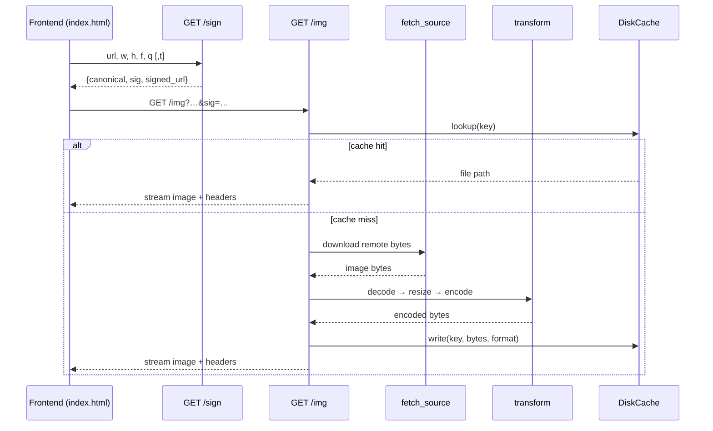
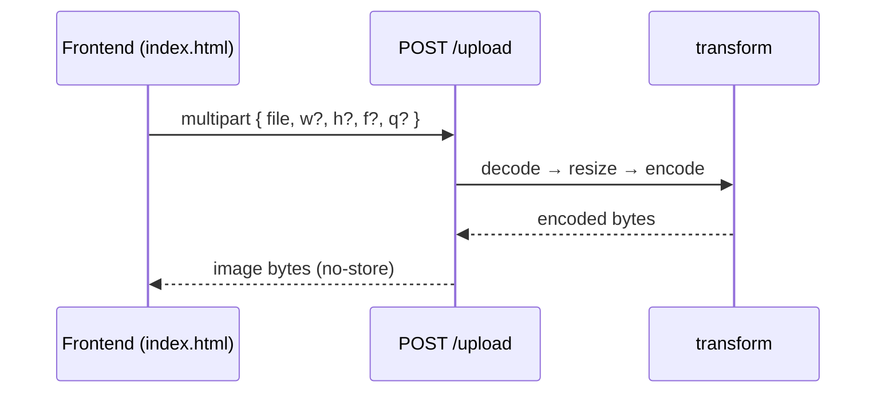

# imagekit

Rust-native image transformation and edge caching for Axum, delivering Cloudinary-level capabilities without external services.

## Features
- Resize (`w`, `h`), format (`f=jpeg|webp|avif`), quality (`q=1..100`)
- HMAC-SHA256 URL signing and optional expiry (`t`)
- Local disk cache with `Cache-Control` and `ETag`
- Streaming responses and async/await throughout
- Static frontend served via `tower-http`
- Direct upload flow via multipart `POST /upload`
- Optional Prometheus metrics

## Run
- `IMAGEKIT_SECRET=your-secret cargo run`
- Open `http://127.0.0.1:8080/` for the demo UI

Config defaults (see `src/main.rs`):
- `IMAGEKIT_SECRET` defaults to `local-dev-secret`
- `max_input_size` is 8MB
- Allowed formats: `jpeg`, `webp`, `avif`
- Default output format: `webp`

## Endpoints

- `GET /sign`
  - Signs a canonical query (excluding `sig`) using the server secret.
  - Query: `url`, optional `w`, `h`, `f`, `q`, `t`.
  - Returns `{ canonical, sig, signed_url }`.
  - Example: `http://127.0.0.1:8080/sign?url=https://upload.wikimedia.org/wikipedia/commons/3/3f/JPEG_example_flower.jpg&w=400&f=webp&q=80`

- `GET /img`
  - Transforms and serves a remote image. Requires `sig` (from `/sign`).
  - Query: `url`, optional `w`, `h`, `f`, `q`, `t`, plus `sig`.
  - Caches the transformed result to disk and streams responses.
  - Example flow: call `/sign`, then open `signed_url`.

- `POST /upload`
  - Transforms an uploaded local image and returns raw image bytes.
  - Multipart fields: `file` (required), `w`, `h`, `f`, `q` (optional).
  - Example:
    - `curl -F "file=@/path/to/photo.jpg" -F w=400 -F f=webp \`
      `http://127.0.0.1:8080/upload --output out.webp`

## Frontend
- Served at `/` (`frontend/index.html`).
- Two flows:
  - "Generate & Preview": signs and loads a remote image via `GET /img`.
  - "Upload & Preview": uploads a local file to `POST /upload` and previews the transformed result.
- Use direct image URLs (Content-Type `image/*`). Sharing pages (e.g., Google Drive share links) often return HTML and will be rejected.
- Sample URLs for testing:
  - `https://upload.wikimedia.org/wikipedia/commons/3/3f/JPEG_example_flower.jpg`
  - `https://upload.wikimedia.org/wikipedia/commons/7/77/Delete_key1.jpg`

## Caching
- Cache key is derived from canonical params.
- Writes include the target format’s file extension.
- Responses set `Cache-Control` and `ETag`.

## Testing
- `cargo test` runs unit and integration tests (signature and transform).

## Notes
- Input size is limited (`max_input_size`) and remote content must be an image type.
- If you need persistent URLs for uploaded images, extend the upload path to write to the cache and return a stable location.

## Flow Diagrams

## Folder Structure Explained

- `src/main.rs` — server entrypoint; loads `IMAGEKIT_SECRET`, builds `router(cfg)`, listens on `127.0.0.1:8080`.
- `src/lib.rs` — route composition and handlers:
  - `handler` for `GET /img` (signed remote transform + caching).
  - `sign_handler` for `GET /sign` (returns `canonical`, `sig`, `signed_url`).
  - `upload_handler` for `POST /upload` (multipart file transform, returns bytes).
  - `router(config)` returns `Router` with `/img`, `/sign`, `/upload`, and static `ServeDir` on `/`.
  - `route(config)` returns a `MethodRouter` convenience for mounting `/img` only.
- `src/config.rs` — `ImageKitConfig` and `ImageFormat` (lowercase variants for serde compatibility) plus validation.
- `src/signature.rs` and `src/security.rs` — HMAC helpers, canonicalization, signing, and `verify_signature` used by `GET /img`.
- `src/fetch.rs` — `fetch_source` for remote downloads with size and content-type checks.
- `src/transform.rs` — core image routines: `ImageBytes::decode`, `resize_image`, `encode_image`.
- `src/cache.rs` and `src/cache/` — `DiskCache` with `key_for`, `get`, `put`, `etag_for`, and content-type helpers.
- `src/handelers/` — placeholder module; not used in current wiring.
- `frontend/index.html` — demo UI with two flows (“Generate & Preview” via `GET /img`, and “Upload & Preview” via `POST /upload`).
- `tests/` — `signature.rs` and `transform.rs` unit/integration tests.